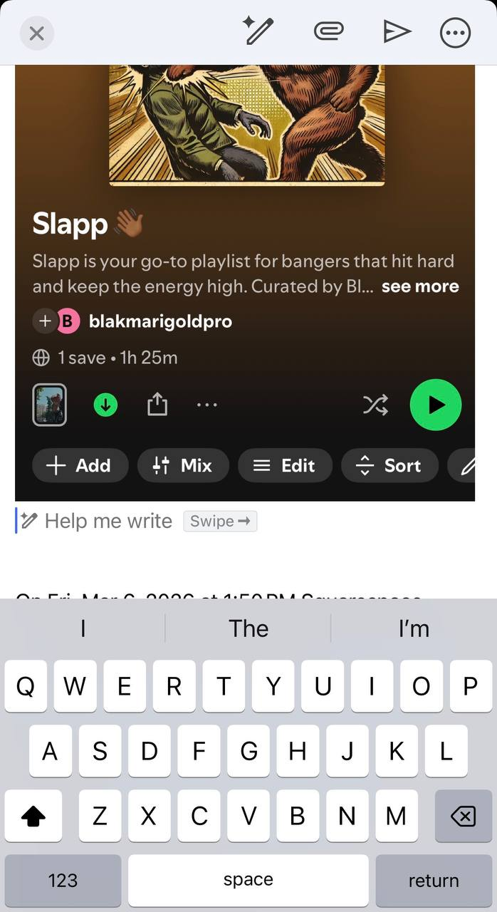

# Demo Setup

## Live Form Demo

Squarespace page:
- https://www.blakmarigold.com/playlist-submission

## Expected Submission Fields

- Name
- Email
- Spotify Song URL
- Optional metadata (genre, socials)

## Zapier Routing Pattern

1. Trigger: Squarespace Form Submission
2. Action: Post message to Discord `#website-forms`
3. Action (optional): Send backup email copy
4. Poller consumes new messages and calls submit flow

## Manual Test Walkthrough

1. Submit valid Spotify track URL via form.
2. Confirm row is queued in `state/spotify_playlist_submissions.csv`.
3. Submitter must **save the playlist** (Spotify terminology) and reply to the verification email with screenshot proof.
4. Run approval:
   - `python src/playlist_manager.py approve --email "artist@example.com"`
5. Verify insertion position in output.
6. Force cleanup test (with edited date) and run:
   - `python src/playlist_manager.py cleanup`

## Screenshots (real workflow evidence)

### Step 2 — Submitter saves playlist

Side note: wording is standardized to **"save playlist"** instead of "like playlist".

### Step 3 — Submitter replies to verification email with screenshot

Side note: this screenshot reply is the human verification gate before auto-add.
